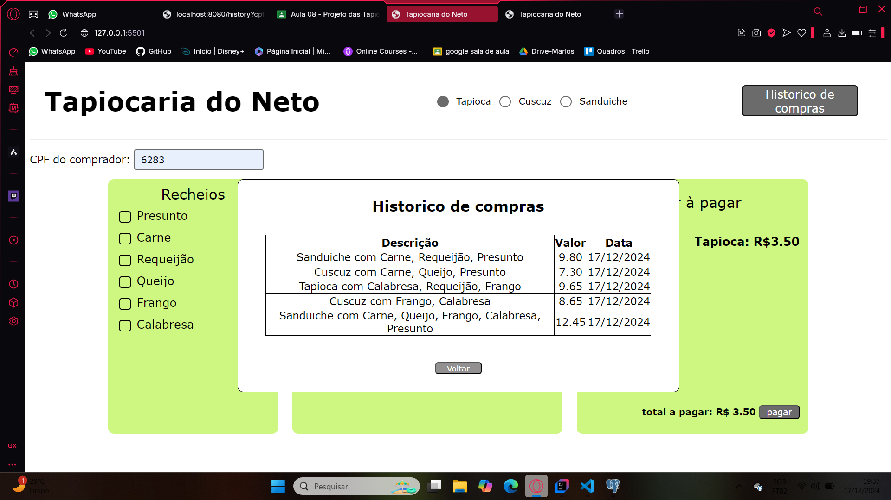

# Sistema de vendas

É possivel escolher entre 3 comidas para comprar(tapioca, cuscuz e sanduiche) e personalizar quais recheios quer na comidas

## Layout da pagina


Ao selecionar a comida e os recheios é calculado o valor total da compra.


##  end-points:

/foods
retorna o preço da comida e os recheios que podem ir na comida
```
http://localhost:8080/food?id=1

exemplo de retorno:
{
  "price": 3.5,
  "filings": [
    {
      "name": "Presunto",
      "price": 0.8
    },
    {
      "price": 1.5,
      "name": "Carne"
    },
    {
      "price": 2,
      "name": "Requeijão"
    },
    {
      "price": 0.5,
      "name": "Queijo"
    },
    {
      "price": 1.75,
      "name": "Frango"
    },
    {
      "name": "Calabresa",
      "price": 2.4
    }
  ]
}
```

/history
```
http://localhost:8080/history?cpf=123

exemplo de retorno:
[
  {
    "id": 81,
    "idfood": 1,
    "cpf": "123",
    "datesale": "2024-12-17 19:08:20.632826",
    "descripition": "Tapioca de queijo",
    "price": 4
  },
  {
    "id": 82,
    "idfood": 3,
    "cpf": "123",
    "datesale": "2024-12-17 19:30:46.888365",
    "descripition": "Sanduiche com Frango, Queijo, Presunto",
    "price": 8.55
  }
]
```

/payment
salva no banco de dados as informações da venda na tabela sales
```
http://localhost:8080/payment?idFood=1&cpf=123&descripition=Tapioca%20de%20queijo&price=4.0
```
tabela sales:


### Histórico de compras:

É feita uma requisição ao end-point /history que retorna quais foram as compras feitas no cpf informado pelo usuário. Se o cpf não tiver nenhuma compra ou não for passado a tabela fica vazia.




### Pagamento

Ao finalizar o pagamento o dialog com a confirmação do pagamento aparece, caso o cfp não seja informado ou coloque caracteres diferentes de números aparece o dialog alertando para verificar o cpf informado.


